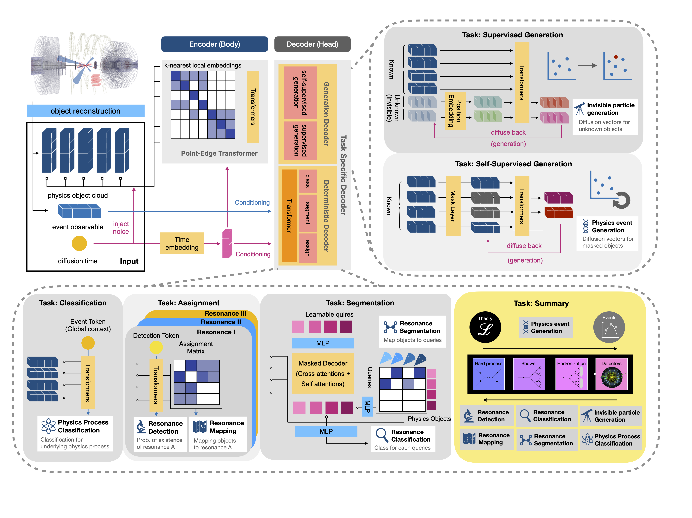

# EveNet 🌌

[](https://evenet-hep.github.io/EveNet-Full/)


EveNet is a pretrained, multi-task foundation model for event-level collider physics. 
It comes with a scalable Ray + PyTorch Lightning training pipeline, SLURM-ready multi-GPU infrastructure, 
and modular YAML configuration, 
so researchers can quickly fine-tune it on their own datasets and extend it to new physics analyses.

---



---

## 🎯 Pretrained Weights

Start directly from pretrained EveNet checkpoints for fine-tuning or inference:

👉 HuggingFace: [Avencast/EveNet](https://huggingface.co/Avencast/EveNet/tree/main)

---

## 📚 Documentation

Explore the full documentation site for setup options, configuration references, and tutorials:

[EveNet-Full](https://evenet-hep.github.io/EveNet-Full/)

---

## 🤝 Citation

If you use EveNet in your research, please cite our paper:

```bibtex
@article{Hsu:2026sww,
    author = "Hsu, Ting-Hsiang and others",
    title = "{EveNet: A Foundation Model for Particle Collision Data Analysis}",
    eprint = "2601.17126",
    archivePrefix = "arXiv",
    primaryClass = "hep-ex",
    month = "1",
    year = "2026"
}
```